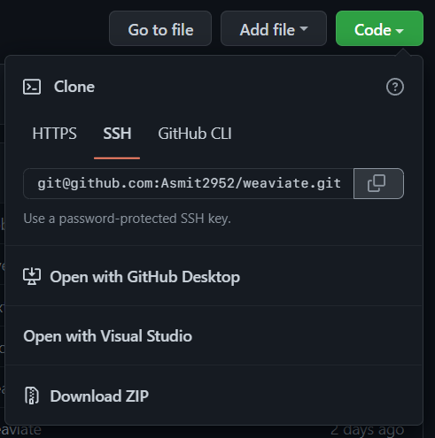

This is a beginner's guide to using git and GitHub to help you contribute to Weaviate. There are four main GitHub repositories of Weaviate, which you can contribute to as beginner. This includes:

* [Weaviate](https://github.com/semi-technologies/weaviate) - our main product Weaviate core
* [Weaviate-io](https://github.com/semi-technologies/weaviate-io) - official Weaviate documentation
* [Weaviate Examples](https://github.com/semi-technologies/weaviate-examples) - apps built using Weaviate vector search engine
* [Awesome Weaviate](https://github.com/semi-technologies/awesome-weaviate) - list of examples and tutorials of how to use the Weaviate vector search engine 

#### Start by Forking

* Simply click the `Fork` button on the GitHub website. That's how easy it is. This will create a copy of the repository in your account.

<!---->

* Once you have done that, head over to your account, select the forked repository, and clone your repo to your local machine.

<!---->

```
git clone git@github.com:<USERNAME>/weaviate.git
```

("weaviate" is used as the example repo. Make careful to cite the particular repository you are contributing to (for example, "weaviate-io").

* After cloning the repository from GitHub, use the change directory command to first move to that folder.

```
cd weaviate
```

* Track the "upstream" repo you forked in order to keep your fork up to date. You'll need to add a remote to complete this:

```
git remote add upstream https://github.com/semi-technologies/weaviate.git
```
* To check if your local copy has a reference and upstream link to the remote repository in GitHub, run the command below.

```
git remote -v
```

Output:

```
origin    https://github.com/Your_Username/weaviate.git (fetch)
origin    https://github.com/Your_Username/weaviate.git (push)
upstream  https://github.com/semi-technologies/weaviate.git (fetch)
upstream  https://github.com/semi-technologies/weaviate.git (push)
```

When you want to update your fork with the most recent upstream changes, you must first fetch the upstream repo's branches and commits to bring them into your repository. This can be done in two ways:

* [Using GitHub and git CLI](#using-github-and-git-cli)
* [Using git CLI]()

##### Using GitHub and git CLI

* Head over to your forked repository, and under `Fetch Upstream`, click `Fetch and merge`. This will bring all the latest changes in your forked repository.

* Next open git CLI, and checkout on `main` branch (if you make any changes, make sure to commit them first).

```
git checkout main
```

* Then pull the changes into local repository.

```
git pull origin main
```

This will sync with the latest changes in your forked repository.

##### Using git CLI

The only difference between this method and the previous one is that you will fetch the remote using CLI. 

* Check out the `main` branch first.

```
git checkout main
```

* Fetch the remote 

```
git fetch upstream
```

* Then pull its changes into your local default branch

```
git pull upstream main
```

* Last, push to your own remote origin to keep the forked repo in sync.

```
git push origin main
```

One liner script for super users:

```
git remote add upstream https://github.com/semi-technologies/weaviate.git || true && git fetch upstream && git checkout main && git pull upstream main && git push origin main
```

##### View all branches including those from upstream

```
git branch -a
```
